# CampuseHive - Senior Project Handoof Guide

> ### Purpose
>This README is written for a new development team taking over CampusHive.  It contains everything you need to build, run, and extend the project in local, staging, and production environments.  Where external services are required, placeholders are provided – create your own accounts and supply credentials via environment variables.

## 1. Project Snapshot
| Layer  | Tech | Notes |
| ------------- | ------------- | ------------- |
| Frontend | Vue 3 (Vite) + Vuetify 3  | Single-Page App (SPA) hosted on Netlify |
| Backend | Spring Boot 3 (Java 21)  | REST API secured with JWT; deployed on Heroku |
| Database | PostgreSQL (Heroku) and H2 (local)  | JPA |
| Storage | Local `/static/images/events/` (directory) | Used to store event images |
| Email | JavaMail Sender | Uses SMTP |
| CI/CD | GitHub Actions | None |

### Main features
- User signup / login (JWT) - roles: USER, ADMIN
- CRUD for Events with image upload (multipart)
- Join / un-join events (many-to-many)
- Comments with admin-side deletion + email notice to author
- Email notifications for event deletion

## 2. Local Development
### 2.1 Prerequisites
| Layer  | Tech | Notes |
| ------------- | ------------- | ------------- |
| Frontend | Vue 3 (Vite) + Vuetify 3  | Single-Page App (SPA) hosted on Netlify |
| Backend | Spring Boot 3 (Java 21)  | REST API secured with JWT; deployed on Heroku |
| Database | PostgreSQL (Heroku) and H2 (local)  | JPA |
| Storage | Local `/static/images/events/` (directory) | Used to store event images |
| Email | JavaMail Sender | Uses SMTP |
| CI/CD | GitHub Actions | None |

## 3. Applications needed for development
### 3.1 Microsoft SSO(Login)

1. Create / Sign in to the Azure portal and create a new registration.

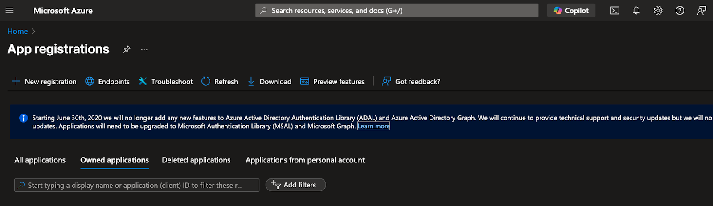

2. Create a single-page application-use your own URIs.
    - We have two URIs, one for local development and the other for production.

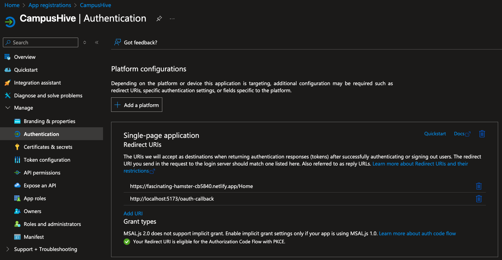

3. Allow implicit grant and hybrid flows.

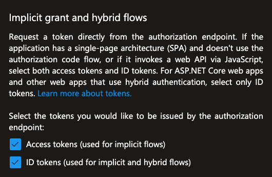

4. Allow only students to access this.

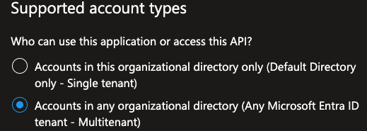

5. Go to API permissions and add these, and grant admin consent after adding the API permissions.

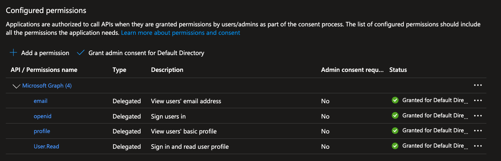

6. Create a Client Secret and save those credentials.

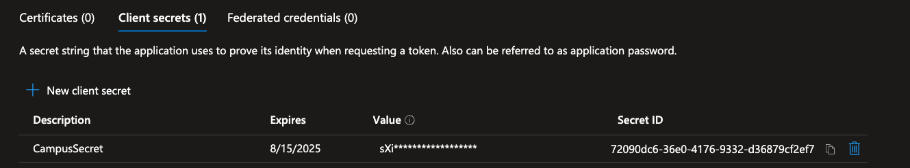

7. Add your new ClientID and URI in a .env file for security(front-end).

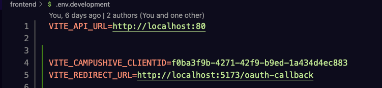

8. How to import these inside the front-end.

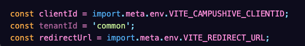

### 3.2 Google SSO(Calendar Sync) Setup

1. Create an account / sign in to Cloud Console and create a project.

2. Go to APIs & Services and click on enable APIs and Services.

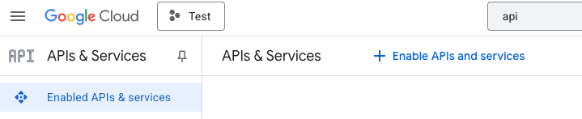

3. Search for the Google Calendar API and enable.

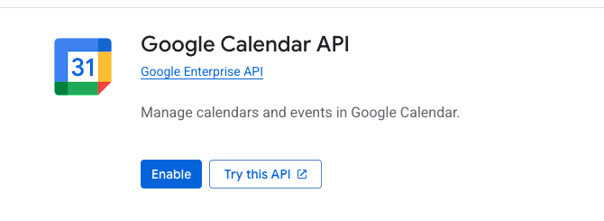

4. Click on OAuth client ID.

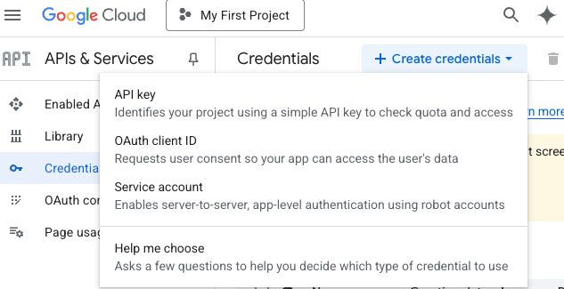

5. Fill out the project configuration.

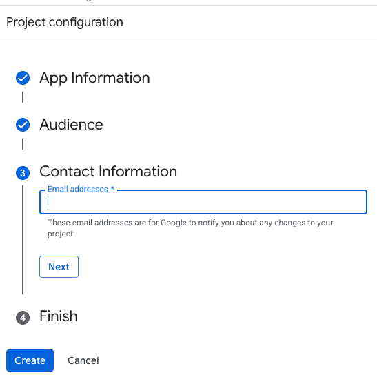

6. Create OAuth clientID & add your own redirect URIs.

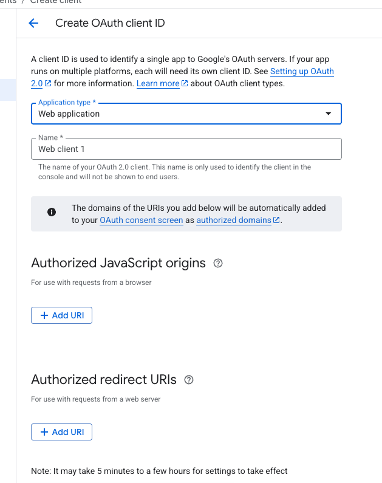

7. Add test users unless you have a website approved by Google.

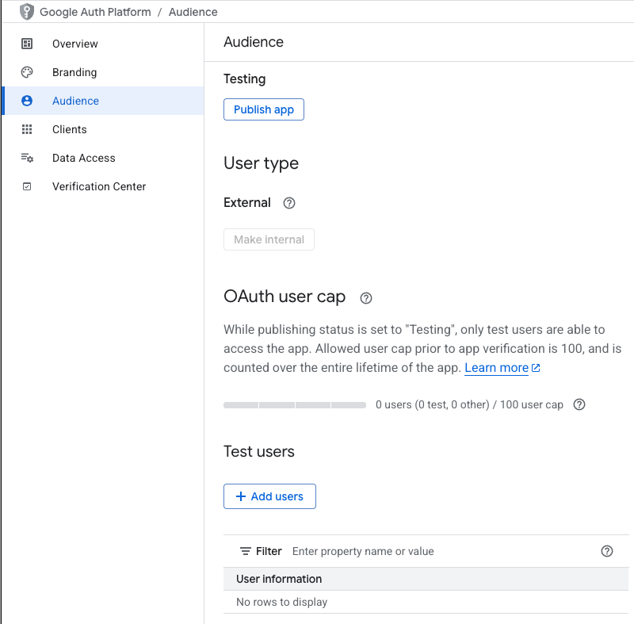

8. Should look something like this / save the credentials somewhere for easy access.

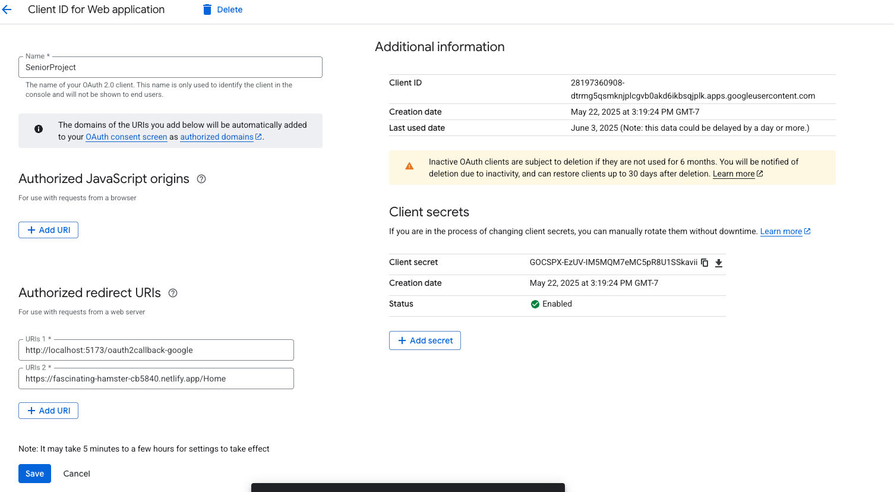

9. Replace these credentials in the application properties with your own. The application properties are located in SeniorProject/src/main/resources/application.properties.

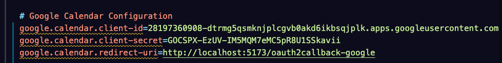

10. Add the clientId and URI to the front-end too.

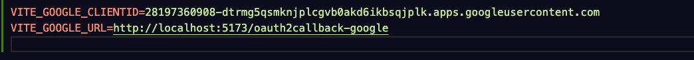

### 3.3 Notifications using Google

1. Create a Google account / sign in 

2. Go to Google Account settings

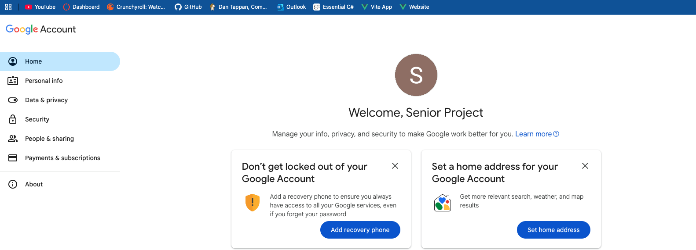

3. Click on security and enable 2-Step verification

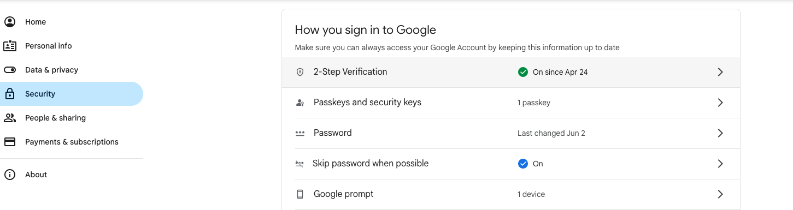

4. Click on App passwords

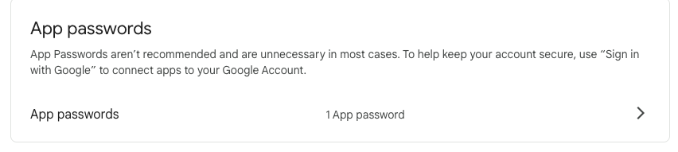

5. Create an App password / save the code

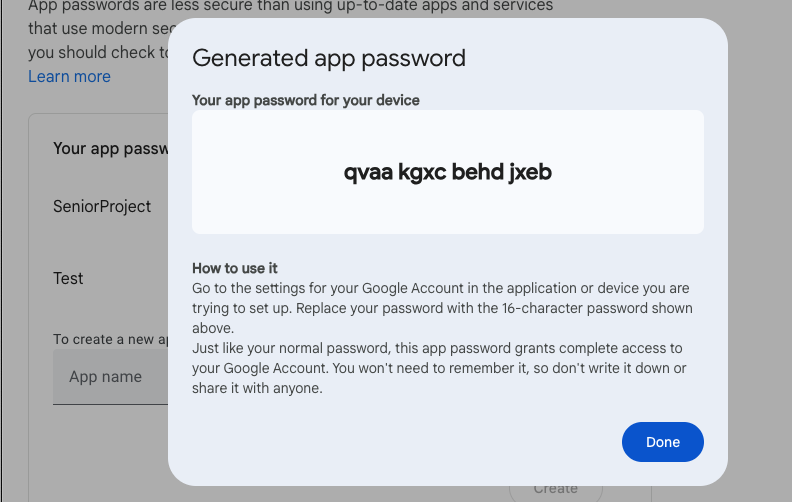

6. Go to Application properties and change the credentials for both username / password

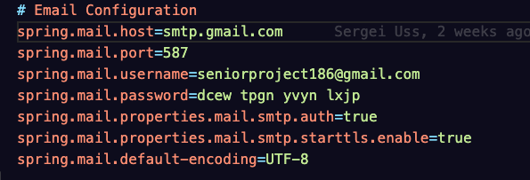